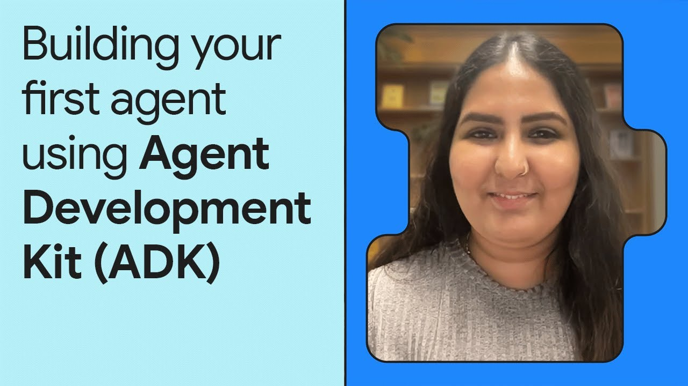

# Community Resources

Welcome! This page highlights resources built and maintained by the Agent
Development Kit community.

!!! info

    Google and the ADK team do not provide support for the content linked in
    these external community resources.

## Getting Started

  <a href="https://www.youtube.com/watch?v=zgrOwow_uTQ" class="resource-card">
    

      
    

    

      
Video Demo

      <h3>📺 Introducing Agent Development Kit</h3>
      
A demo of building a multi-agent travel planner, showcasing core design principles.

    

  </a>
  <a href="https://www.youtube.com/watch?v=44C8u0CDtSo" class="resource-card">
    

      
    

    

      
Video

      <h3>📺 Getting started with Agent Development Kit</h3>
      
Learn the fundamentals of agent definition and how to run and debug your first agent.

    

  </a>
  <a href="https://www.youtube.com/watch?v=5ZmaWY7UX6k" class="resource-card">
    

      
    

    

      
Video

      <h3>📺 Getting Started with ADK Tools</h3>
      
A guide to building a software bug assistant using tools like MCP and Google Search.

    

  </a>

## Courses & Deep Dives

  <a href="https://www.youtube.com/watch?v=P4VFL9nIaIA" class="resource-card">
    

      
    

    

      
Video Course

      <h3>🎓 ADK Masterclass: Build AI Agents & Automate Workflows</h3>
      
A complete crash course that takes you from beginner to expert with 12 hands-on examples.

    

  </a>
  <a href="https://raphaelmansuy.github.io/adk_training/" class="resource-card">
    

      
    

    

      
Website

      <h3>🎓 ADK Training Hub</h3>
      
Master ADK from first principles to production with comprehensive tutorials and examples.

    

  </a>
  <a href="https://www.youtube.com/playlist?list=PLLrA_pU9-Gz2HwepRUVpq1TEPuYWo_fSi" class="resource-card">
    

      
    

    

      
YouTube Playlist

      <h3>🎓 Master Agentic AI with ADK</h3>
      
A step-by-step playlist covering everything from setup to deploying and scaling agents.

    

  </a>
  <a href="https://www.youtube.com/playlist?list=PL6tW9BrhiPTAZts0W5nQS9dbW6VMnLKab" class="resource-card">
    

      
    

    

      
YouTube Playlist

      <h3>🎓 Google ADK End-to-end Course</h3>
      
Build, deploy, and scale production-ready agents with this in-depth course series.

    

  </a>
  <a href="https://iamulya.one/tags/building-intelligent-agents-with-google-adk/" class="resource-card">
    

      
    

    

      
Blog Series

      <h3>🎓 Building Intelligent Agents with Google ADK</h3>
      
A developer's guide to building intelligent agents with Google’s code-first Python toolkit.

    

  </a>

## Agent Tutorials and Demos

  <a href="https://www.youtube.com/watch?v=efcUXoMX818" class="resource-card">
    

      
    

    

      
Video Tutorial

      <h3>📖 How to Build a Data Science Agent with ADK</h3>
      
A deep dive into building a multi-agent system for database queries, Python analysis, and BigQuery ML.

    

  </a>
  <a href="https://www.youtube.com/watch?v=hPzjkQFV5yI" class="resource-card">
    

      
    

    

      
Video Tutorial

      <h3>📖 Build a Browser Use Agent with ADK and Selenium</h3>
      
Learn to build an agent that enhances a retail website's product data by filling in missing information.

    

  </a>
  <a href="https://github.com/google/adk-docs/blob/main/examples/python/notebooks/shop_agent.ipynb" class="resource-card">
    

      
    

    

      
Jupyter Notebook

      <h3>📖 Build an E-commerce Recommendation Agent</h3>
      
A tutorial on creating a simple multi-agent system for generative e-commerce recommendations.

    

  </a>
  <a href="https://medium.com/google-cloud/google-adk-vertex-ai-live-api-125238982d5e" class="resource-card">
    

      
    

    

      
Blog Post

      <h3>📖 Google ADK + Vertex AI Live API</h3>
      
Go beyond the ADK CLI by building real-time, streaming experiences with the Live API.

    

  </a>
  <a href="https://www.youtube.com/watch?v=LwHPYyw7u6U" class="resource-card">
    

      
    

    

      
Video Demo

      <h3>📺 Shopper's Concierge Demo</h3>
      
See how AI agents can revolutionize shopping with personalized, real-time recommendations.

    

  </a>

## ADK for Java

  <a href="https://www.youtube.com/watch?v=L6V6aQixOZU" class="resource-card">
    

      
    

    

      
Video Talk

      <h3>☕ Discover ADK Java for Building AI Agents</h3>
      
A presentation to help you build your first AI agents in Java.

    

  </a>
  <a href="https://www.youtube.com/playlist?list=PLLMxXO6kMiNhP87WYQ8CeC3xpV3EnF9cu" class="resource-card">
    

      
    

    

      
YouTube Playlist

      <h3>☕ Google ADK for Java Tutorials</h3>
      
Step-by-step tutorials covering A2A, MCP, multi-agent systems, and callbacks in Java.

    

  </a>
  <a href="https://codelabs.developers.google.com/adk-java-getting-started" class="resource-card">
    

      
    

    

      
Codelab

      <h3>☕ Build AI Agents with ADK for Java</h3>
      
Move beyond simple LLM calls to create autonomous Java agents that reason, plan, and use tools.

    

  </a>

## Translations

Community-provided translations of the ADK documentation.

<ul class="translation-list">
  <li><a href="https://adk.wiki/">🇨🇳 Chinese (中文) Documentation</a></li>
  <li><a href="https://adk-labs.github.io/adk-docs/ko/">🇰🇷 Korean (한국어) Documentation</a></li>
  <li><a href="https://adk-labs.github.io/adk-docs/ja/">🇯🇵 Japanese (日本語) Documentation</a></li>
</ul>

## Contributing Your Resource

Have an ADK resource to share (tutorial, translation, tool, video, or example)?

Refer to the steps in the **[Contributing Guide](contributing-guide.md)** for more information on how to get involved!

Thank you for your contributions to Agent Development Kit! ❤️
