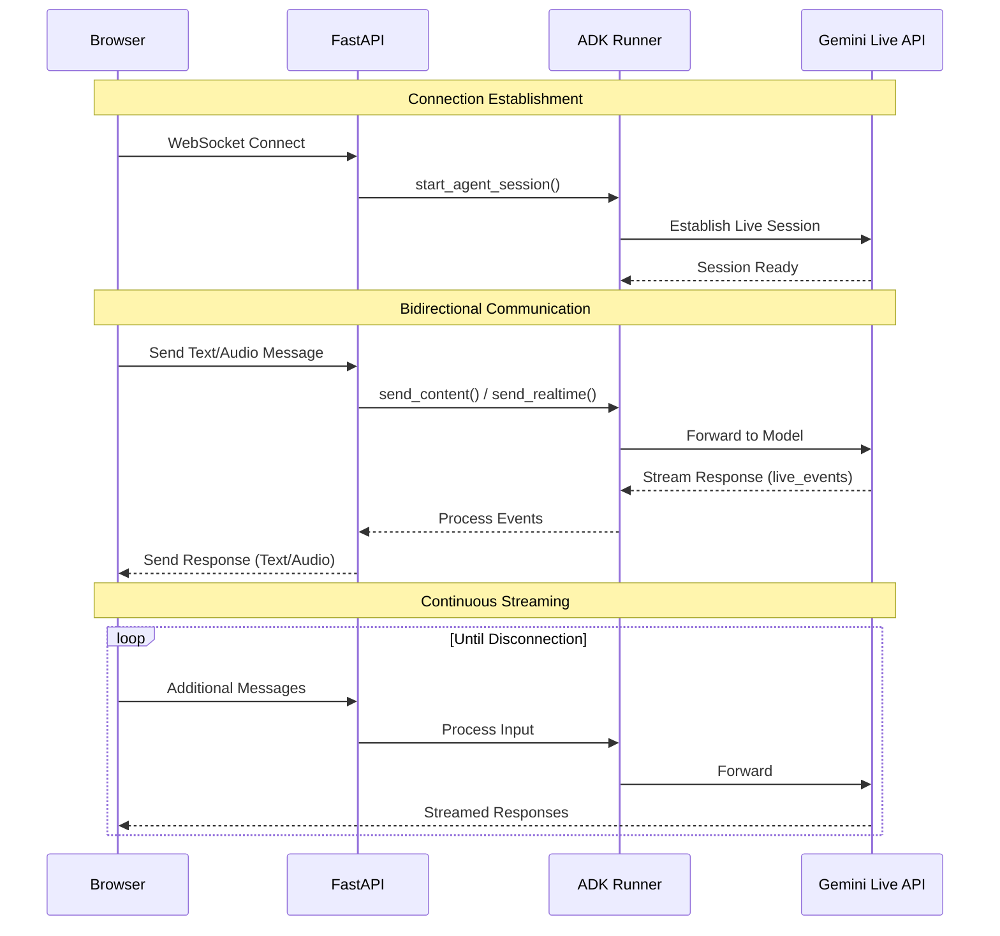

# Custom Audio Streaming Application (WebSocket) {#custom-streaming-websocket}

This article overviews the server and client code for a custom Bidi-streaming web application built with ADK Bidi-streaming and [FastAPI](https://fastapi.tiangolo.com/), enabling real-time, bidirectional audio and text communication with WebSockets.

**Note:** This guide assumes you have experience of JavaScript and Python `asyncio` programming.

## Supported models for voice/video streaming {#supported-models}

In order to use voice/video streaming in ADK, you will need to use Gemini models that support the Live API. You can find the **model ID(s)** that supports the Gemini Live API in the documentation:

- [Google AI Studio: Gemini Live API](https://ai.google.dev/gemini-api/docs/models#live-api)
- [Vertex AI: Gemini Live API](https://cloud.google.com/vertex-ai/generative-ai/docs/live-api)

## 1. Install ADK {#1-setup-installation}

Download the sample code:

```bash
curl -L https://github.com/google/adk-docs/archive/refs/heads/main.tar.gz | \
  tar xz --strip=5 adk-docs-main/examples/python/snippets/streaming/adk-streaming-ws

cd adk-streaming-ws
```

Create & Activate Virtual Environment (Recommended):

```bash
# Create
python -m venv .venv
# Activate (each new terminal)
# macOS/Linux: source .venv/bin/activate
# Windows CMD: .venv\Scripts\activate.bat
# Windows PowerShell: .venv\Scripts\Activate.ps1
```

Install ADK:

```bash
pip install --upgrade google-adk==1.17.0
```

Set `SSL_CERT_FILE` variable with the following command.

```bash
export SSL_CERT_FILE=$(python -m certifi)
```

Navigate to the app folder:

```bash
cd app
```

This sample code has the following files and folders:

```console
adk-streaming-ws/
└── app/ # the web app folder
    ├── .env # Gemini API key / Google Cloud Project ID
    ├── main.py # FastAPI web app
    ├── static/ # Static content folder
    |   ├── js # JavaScript files folder (includes app.js)
    |   └── index.html # The web client page
    └── google_search_agent/ # Agent folder
        ├── __init__.py # Python package
        └── agent.py # Agent definition
```

## 2. Set up the platform {#2-set-up-the-platform}

To run the sample app, choose a platform from either Google AI Studio or Google Cloud Vertex AI:

=== "Gemini - Google AI Studio"
    1. Get an API key from [Google AI Studio](https://aistudio.google.com/apikey).
    2. Open the **`.env`** file located inside (`app/`) and copy-paste the following code.

        ```env title=".env"
        GOOGLE_GENAI_USE_VERTEXAI=FALSE
        GOOGLE_API_KEY=PASTE_YOUR_ACTUAL_API_KEY_HERE
        DEMO_AGENT_MODEL=gemini-2.5-flash-native-audio-preview-09-2025
        #DEMO_AGENT_MODEL=gemini-2.0-flash-exp # if the model above doesn't work
        ```

    3. Replace `PASTE_YOUR_ACTUAL_API_KEY_HERE` with your actual `API KEY`.

=== "Gemini - Google Cloud Vertex AI"
    1. You need an existing
       [Google Cloud](https://cloud.google.com/?e=48754805&hl=en) account and a
       project.
        * Set up a
          [Google Cloud project](https://cloud.google.com/vertex-ai/generative-ai/docs/start/quickstarts/quickstart-multimodal#setup-gcp)
        * Set up the
          [gcloud CLI](https://cloud.google.com/vertex-ai/generative-ai/docs/start/quickstarts/quickstart-multimodal#setup-local)
        * Authenticate to Google Cloud, from the terminal by running
          `gcloud auth login`.
        * [Enable the Vertex AI API](https://console.cloud.google.com/flows/enableapi?apiid=aiplatform.googleapis.com).
    2. Open the **`.env`** file located inside (`app/`). Copy-paste
       the following code and update the project ID and location.

        ```env title=".env"
        GOOGLE_GENAI_USE_VERTEXAI=TRUE
        GOOGLE_CLOUD_PROJECT=PASTE_YOUR_ACTUAL_PROJECT_ID
        GOOGLE_CLOUD_LOCATION=us-central1
        DEMO_AGENT_MODEL=gemini-live-2.5-flash-preview-native-audio-09-2025
        #DEMO_AGENT_MODEL=gemini-2.0-flash-exp # if the model above doesn't work
        ```


### agent.py

The agent definition code `agent.py` in the `google_search_agent` folder is where the agent's logic is written:


```py
import os
from google.adk.agents import Agent
from google.adk.tools import google_search  # Import the tool

root_agent = Agent(
   name="google_search_agent",
   model=os.getenv("DEMO_AGENT_MODEL"),
   description="Agent to answer questions using Google Search.",
   instruction="Answer the question using the Google Search tool.",
   tools=[google_search],
)
```

**Note:** This application uses the Gemini Live API (also known as `bidiGenerateContent`), which enables real-time bidirectional streaming for both text and audio/video input. The model must support the Live API for Bidi-streaming to work. Verify model capabilities by referring to:

- [Gemini Live API - Supported Models](https://ai.google.dev/gemini-api/docs/live#supported-models)
- [Vertex AI Live API - Model Support](https://cloud.google.com/vertex-ai/generative-ai/docs/live-api#models)

The agent uses the model specified in the `DEMO_AGENT_MODEL` environment variable (from the `.env` file).

Notice how easily you integrated [grounding with Google Search](https://ai.google.dev/gemini-api/docs/grounding?lang=python#configure-search) capabilities.  The `Agent` class and the `google_search` tool handle the complex interactions with the LLM and grounding with the search API, allowing you to focus on the agent's *purpose* and *behavior*.


## 3. Interact with Your Streaming Application {#3-interact-with-your-streaming-app}

1. **Navigate to the Correct Directory:**

   To run your agent effectively, make sure you are in the **app folder (`adk-streaming-ws/app`)**

2. **Start the Fast API**: Run the following command to start CLI interface with

```bash
uvicorn main:app --reload
```

3. **Access the app with the text mode:** Once the app starts, the terminal will display a local URL (e.g., [http://localhost:8000](http://localhost:8000)). Click this link to open the UI in your browser.

Now you should see the UI like this:


Try asking a question `What time is it now?`. The agent will use Google Search to respond to your queries. You would notice that the UI shows the agent's response as streaming text. You can also send messages to the agent at any time, even while the agent is still responding. This demonstrates the bidirectional communication capability of ADK Streaming.

4. **Access the app with the audio mode:** Now click the `Start Audio` button. The app reconnects with the server in an audio mode, and the UI will show the following dialog for the first time:


Click `Allow while visiting the site`, then you will see the microphone icon will be shown at the top of the browser:


Now you can talk to the agent with voice. Ask questions like `What time is it now?` with voice and you will hear the agent responding in voice too. As Streaming for ADK supports [multiple languages](https://ai.google.dev/gemini-api/docs/live#supported-languages), it can also respond to question in the supported languages.

5. **Check console logs**

If you are using the Chrome browser, use the right click and select `Inspect` to open the DevTools. On the `Console`, you can see the incoming and outgoing audio data such as `[CLIENT TO AGENT]` and `[AGENT TO CLIENT]`, representing the audio data streaming in and out between the browser and the server.

At the same time, in the app server console, you should see something like this:

```
INFO:     ('127.0.0.1', 50068) - "WebSocket /ws/70070018?is_audio=true" [accepted]
Client #70070018 connected, audio mode: true
INFO:     connection open
INFO:     127.0.0.1:50061 - "GET /static/js/pcm-player-processor.js HTTP/1.1" 200 OK
INFO:     127.0.0.1:50060 - "GET /static/js/pcm-recorder-processor.js HTTP/1.1" 200 OK
[AGENT TO CLIENT]: audio/pcm: 9600 bytes.
INFO:     127.0.0.1:50082 - "GET /favicon.ico HTTP/1.1" 404 Not Found
[AGENT TO CLIENT]: audio/pcm: 11520 bytes.
[AGENT TO CLIENT]: audio/pcm: 11520 bytes.
```

These console logs are important in case you develop your own streaming application. In many cases, the communication failure between the browser and server becomes a major cause for the streaming application bugs.

6. **Troubleshooting tips**

- **When `ws://` doesn't work:** If you see any errors on the Chrome DevTools with regard to `ws://` connection, try replacing `ws://` with `wss://` on `app/static/js/app.js` at line 28. This may happen when you are running the sample on a cloud environment and using a proxy connection to connect from your browser.
- **When the model doesn't work:** If you see any errors on the app server console with regard to model availability, try using the alternative model by uncommenting the `#DEMO_AGENT_MODEL=gemini-2.0-flash-exp` line in your `.env` file and commenting out the current `DEMO_AGENT_MODEL` line.

## 4. Server code overview {#4-server-side-code-overview}

This server application enables real-time, streaming interaction with an ADK agent via WebSockets. Clients send text/audio to the ADK agent and receive streamed text/audio responses.

Core functions:
1.  Initialize/manage ADK agent sessions.
2.  Handle client WebSocket connections.
3.  Relay client messages to the ADK agent.
4.  Stream ADK agent responses (text/audio) to clients.

### Architecture Overview

The following diagram illustrates how components interact in this streaming application:



**Key Components:**
- **Browser:** WebSocket client that sends/receives text and audio data
- **FastAPI:** Server handling WebSocket connections and routing messages
- **ADK Runner:** Manages agent sessions and coordinates with Gemini Live API
- **Gemini Live API:** Processes requests and streams responses (text/audio)

### ADK Streaming Setup

```py
import os
import json
import asyncio
import base64
import warnings

from pathlib import Path
from dotenv import load_dotenv

# Load environment variables BEFORE importing the agent
load_dotenv()

from google.genai import types
from google.genai.types import (
    Part,
    Content,
    Blob,
)

from google.adk.runners import Runner
from google.adk.agents import LiveRequestQueue
from google.adk.agents.run_config import RunConfig, StreamingMode
from google.adk.sessions.in_memory_session_service import InMemorySessionService

from fastapi import FastAPI, WebSocket
from fastapi.staticfiles import StaticFiles
from fastapi.responses import FileResponse
from fastapi.websockets import WebSocketDisconnect

from google_search_agent.agent import root_agent

warnings.filterwarnings("ignore", category=UserWarning, module="pydantic")
```

*   **Imports:** Includes standard Python libraries (`os`, `json`, `asyncio`, `base64`, `warnings`), `dotenv` for environment variables, Google ADK (`types`, `Part`, `Content`, `Blob`, `Runner`, `LiveRequestQueue`, `RunConfig`, `StreamingMode`, `InMemorySessionService`), and FastAPI (`FastAPI`, `WebSocket`, `StaticFiles`, `FileResponse`, `WebSocketDisconnect`).
*   **`load_dotenv()`:** Called immediately after importing dotenv and **before** importing the agent. This ensures environment variables (like `DEMO_AGENT_MODEL`) are available when the agent module initializes.
*   **`warnings.filterwarnings()`:** Suppresses Pydantic UserWarnings to reduce console noise during development.

**Initialization:**

```py
#
# ADK Streaming
#

# Application configuration
APP_NAME = "adk-streaming-ws"

# Initialize session service
session_service = InMemorySessionService()

# APP_NAME and session_service are defined in the Initialization section above
runner = Runner(
    app_name=APP_NAME,
    agent=root_agent,
    session_service=session_service,
)
```

*   **`APP_NAME`**: Application identifier for ADK.
*   **`session_service = InMemorySessionService()`**: Initializes an in-memory ADK session service, suitable for single-instance or development use. Production might use a persistent store.
*   **`runner = Runner(...)`**: Creates the Runner instance **once at module level** (production-ready pattern). This reuses the same runner for all connections, improving performance and resource utilization.

#### `start_agent_session(user_id, is_audio=False)`

```py
async def start_agent_session(user_id, is_audio=False):
    """Starts an agent session"""

    # Get or create session (recommended pattern for production)
    session_id = f"{APP_NAME}_{user_id}"
    session = await runner.session_service.get_session(
        app_name=APP_NAME,
        user_id=user_id,
        session_id=session_id,
    )
    if not session:
        session = await runner.session_service.create_session(
            app_name=APP_NAME,
            user_id=user_id,
            session_id=session_id,
        )

    # Configure response format based on client preference
    # IMPORTANT: You must choose exactly ONE modality per session
    # Either ["TEXT"] for text responses OR ["AUDIO"] for voice responses
    # You cannot use both modalities simultaneously in the same session

    # Force AUDIO modality for native audio models regardless of client preference
    model_name = root_agent.model if isinstance(root_agent.model, str) else root_agent.model.model
    is_native_audio = "native-audio" in model_name.lower()

    modality = "AUDIO" if (is_audio or is_native_audio) else "TEXT"

    # Enable session resumption for improved reliability
    # For audio mode, enable output transcription to get text for UI display
    run_config = RunConfig(
        streaming_mode=StreamingMode.BIDI,
        response_modalities=[modality],
        session_resumption=types.SessionResumptionConfig(),
        output_audio_transcription=types.AudioTranscriptionConfig() if (is_audio or is_native_audio) else None,
    )

    # Create LiveRequestQueue in async context (recommended best practice)
    # This ensures the queue uses the correct event loop
    live_request_queue = LiveRequestQueue()

    # Start streaming session - returns async iterator for agent responses
    live_events = runner.run_live(
        user_id=user_id,
        session_id=session.id,
        live_request_queue=live_request_queue,
        run_config=run_config,
    )
    return live_events, live_request_queue
```

This function initializes an ADK agent live session. It uses `APP_NAME` and `session_service` which are defined in the Initialization section above.

| **Parameter** | **Type** | **Description** |
|---|---|---|
| `user_id` | `str` | Unique client identifier. |
| `is_audio` | `bool` | `True` for audio responses, `False` for text (default). |

**Key Steps:**
1.  **Get or Create Session:** Attempts to retrieve an existing session, or creates a new one if it doesn't exist. This pattern supports session persistence and resumption.
2.  **Detect Native Audio Models:** Checks if the agent's model name contains "native-audio" to automatically force AUDIO modality for native audio models.
3.  **Configure Response Modality:** Sets modality to "AUDIO" if either `is_audio=True` or the model is a native audio model, otherwise "TEXT". Note: You must choose exactly ONE modality per session.
4.  **Enable Session Resumption:** Configures `session_resumption=types.SessionResumptionConfig()` for improved reliability during network interruptions.
5.  **Enable Output Transcription (Audio Mode):** When using audio mode or native audio models, enables `output_audio_transcription` to get text representation of audio responses for UI display.
6.  **Create LiveRequestQueue:** Creates a queue in async context (best practice) for sending client inputs to the agent.
7.  **Start Agent Session:** Calls `runner.run_live(...)` to start the streaming session, returning `live_events` (async iterator for agent responses) and the `live_request_queue`.

**Returns:** `(live_events, live_request_queue)`.

#### Output Audio Transcription

When using audio mode (`is_audio=True`) or native audio models (`is_native_audio=True`), the application enables output audio transcription through `RunConfig`:

```py
output_audio_transcription=types.AudioTranscriptionConfig() if (is_audio or is_native_audio) else None,
```

**Audio Transcription Features:**

- **Native Audio Model Support** - Works with models that have native audio output capability
- **Text Representation** - Provides text transcription of audio responses for UI display
- **Dual Output** - Enables both audio playback and text visualization simultaneously
- **Enhanced Accessibility** - Allows users to see what the agent is saying while hearing it

**Use Cases:**

- Display audio responses as text in the UI for better user experience
- Enable accessibility features for users who prefer text
- Support debugging by logging what the agent says
- Create conversation transcripts alongside audio

**Note:** This feature requires models that support output audio transcription. Not all Live API models may support this capability.

#### Session Resumption Configuration

ADK supports live session resumption to improve reliability during streaming conversations. This feature enables automatic reconnection when live connections are interrupted due to network issues.

This sample application enables session resumption by default in the `RunConfig`:

```py
run_config = RunConfig(
    streaming_mode=StreamingMode.BIDI,
    response_modalities=[modality],
    session_resumption=types.SessionResumptionConfig()
)
```

##### Session Resumption Features

- **Automatic Handle Caching** - The system automatically caches session resumption handles during live conversations
- **Transparent Reconnection** - When connections are interrupted, the system attempts to resume using cached handles
- **Context Preservation** - Conversation context and state are maintained across reconnections
- **Network Resilience** - Provides better user experience during unstable network conditions

##### Implementation Notes

- Session resumption handles are managed internally by the ADK framework
- No additional client-side code changes are required
- The feature is particularly beneficial for long-running streaming conversations
- Connection interruptions become less disruptive to the user experience

##### Disabling Session Resumption (Optional)

If you encounter errors with session resumption or want to disable it:

1. **Check model compatibility** - Ensure you're using a model that supports session resumption
2. **API limitations** - Some session resumption features may not be available in all API versions
3. **Disable session resumption** - You can disable session resumption by removing the `session_resumption` parameter from `RunConfig`:

```py
# Disable session resumption
run_config = RunConfig(
    streaming_mode=StreamingMode.BIDI,
    response_modalities=[modality]
)
```

---

Now that we've covered session initialization and optional enhancements, let's explore the core messaging functions that handle bidirectional communication between the client and the ADK agent.

#### `agent_to_client_messaging(websocket, live_events)`

```py

async def agent_to_client_messaging(websocket, live_events):
    """Agent to client communication"""
    try:
        async for event in live_events:

            # Handle output audio transcription for native audio models
            # This provides text representation of audio output for UI display
            if event.output_transcription and event.output_transcription.text:
                transcript_text = event.output_transcription.text
                message = {
                    "mime_type": "text/plain",
                    "data": transcript_text,
                    "is_transcript": True
                }
                await websocket.send_text(json.dumps(message))
                print(f"[AGENT TO CLIENT]: audio transcript: {transcript_text}")
                # Continue to process audio data if present
                # Don't return here as we may want to send both transcript and audio

            # Read the Content and its first Part
            part: Part = (
                event.content and event.content.parts and event.content.parts[0]
            )
            if part:
                # Audio data must be Base64-encoded for JSON transport
                is_audio = part.inline_data and part.inline_data.mime_type.startswith("audio/pcm")
                if is_audio:
                    audio_data = part.inline_data and part.inline_data.data
                    if audio_data:
                        message = {
                            "mime_type": "audio/pcm",
                            "data": base64.b64encode(audio_data).decode("ascii")
                        }
                        await websocket.send_text(json.dumps(message))
                        print(f"[AGENT TO CLIENT]: audio/pcm: {len(audio_data)} bytes.")

                # If it's text and a partial text, send it (for cascade audio models or text mode)
                if part.text and event.partial:
                    message = {
                        "mime_type": "text/plain",
                        "data": part.text
                    }
                    await websocket.send_text(json.dumps(message))
                    print(f"[AGENT TO CLIENT]: text/plain: {message}")

            # If the turn complete or interrupted, send it
            if event.turn_complete or event.interrupted:
                message = {
                    "turn_complete": event.turn_complete,
                    "interrupted": event.interrupted,
                }
                await websocket.send_text(json.dumps(message))
                print(f"[AGENT TO CLIENT]: {message}")
    except WebSocketDisconnect:
        print("Client disconnected from agent_to_client_messaging")
    except Exception as e:
        print(f"Error in agent_to_client_messaging: {e}")
```

This asynchronous function streams ADK agent events to the WebSocket client.

**Logic:**
1.  Iterates through `live_events` from the agent.
2.  **Audio Transcription (Native Audio Models):** If the event contains output audio transcription text, sends it to the client with an `is_transcript` flag: `{ "mime_type": "text/plain", "data": "<transcript_text>", "is_transcript": True }`. This enables displaying the audio content as text in the UI.
3.  **Content Processing:**
    *   Extracts the first `Part` from event content (if it exists).
    *   **Audio Data:** If audio (PCM), Base64 encodes and sends it as JSON: `{ "mime_type": "audio/pcm", "data": "<base64_audio>" }`.
    *   **Text Data (Cascade Audio Models or Text Mode):** If partial text, sends it as JSON: `{ "mime_type": "text/plain", "data": "<partial_text>" }`.
4.  **Turn Completion/Interruption:** Sends status flags to the client at the end of each event (see explanation below).
5.  Logs messages.

**Understanding Turn Completion and Interruption Events:**

These events are critical for managing bidirectional streaming conversations:

- **`turn_complete`**: Signals that the agent has finished generating a complete response. This event:
  - Marks the end of the agent's response turn
  - Allows the UI to prepare for the next conversation turn
  - Helps manage conversation state and flow
  - In the UI: Resets `currentMessageId` to `null` so the next agent response creates a new message element

- **`interrupted`**: Signals that the agent's response was interrupted (e.g., when the user starts speaking during the agent's audio response). This event:
  - Indicates the current agent turn was cut short
  - Enables natural conversation flow where users can interrupt the agent
  - In the UI: Stops audio playback immediately by sending `{ command: "endOfAudio" }` to the audio player worklet
  - Prevents the agent from continuing to speak while the user is talking

Both events are handled silently in the UI without visual indicators, prioritizing a seamless conversational experience.

#### `client_to_agent_messaging(websocket, live_request_queue)`

```py

async def client_to_agent_messaging(websocket, live_request_queue):
    """Client to agent communication"""
    try:
        while True:
            message_json = await websocket.receive_text()
            message = json.loads(message_json)
            mime_type = message["mime_type"]
            data = message["data"]

            if mime_type == "text/plain":
                # send_content() sends text in "turn-by-turn mode"
                # This signals a complete turn to the model, triggering immediate response
                content = Content(role="user", parts=[Part.from_text(text=data)])
                live_request_queue.send_content(content=content)
                print(f"[CLIENT TO AGENT]: {data}")
            elif mime_type == "audio/pcm":
                # send_realtime() sends audio in "realtime mode"
                # Data flows continuously without turn boundaries, enabling natural conversation
                # Audio is Base64-encoded for JSON transport, decode before sending
                decoded_data = base64.b64decode(data)
                live_request_queue.send_realtime(Blob(data=decoded_data, mime_type=mime_type))
            else:
                raise ValueError(f"Mime type not supported: {mime_type}")
    except WebSocketDisconnect:
        print("Client disconnected from client_to_agent_messaging")
    except Exception as e:
        print(f"Error in client_to_agent_messaging: {e}")
```

This asynchronous function relays messages from the WebSocket client to the ADK agent.

**Logic:**
1.  Receives and parses JSON messages from the WebSocket, expecting: `{ "mime_type": "text/plain" | "audio/pcm", "data": "<data>" }`.
2.  **Text Input:** For "text/plain", sends `Content` to agent via `live_request_queue.send_content()`.
3.  **Audio Input:** For "audio/pcm", decodes Base64 data, wraps in `Blob`, and sends via `live_request_queue.send_realtime()`.
4.  Raises `ValueError` for unsupported MIME types.
5.  Logs messages.

**Error Handling:**

Both `agent_to_client_messaging` and `client_to_agent_messaging` functions include try-except blocks to handle WebSocket disconnections gracefully:

- **`WebSocketDisconnect`**: Catches when the client disconnects unexpectedly and logs the disconnection without raising an error
- **Generic `Exception`**: Catches any other errors (JSON parsing, Base64 decoding, etc.) and logs them for debugging

This error handling ensures:
- Clean shutdown when clients disconnect
- Proper logging for debugging connection issues
- The WebSocket connection closes gracefully without propagating unhandled exceptions
- The `FIRST_EXCEPTION` condition in `asyncio.wait()` can still trigger for cleanup

For production environments, consider additional error handling:
- Send error messages back to the client to inform them of invalid input (before the connection closes)
- Implement retry logic for transient failures
- Add monitoring and alerting for error patterns
- Validate message structure before processing to provide better error messages

### FastAPI Web Application

```py

#
# FastAPI web app
#

app = FastAPI()

STATIC_DIR = Path("static")
app.mount("/static", StaticFiles(directory=STATIC_DIR), name="static")


@app.get("/")
async def root():
    """Serves the index.html"""
    return FileResponse(os.path.join(STATIC_DIR, "index.html"))


@app.websocket("/ws/{user_id}")
async def websocket_endpoint(websocket: WebSocket, user_id: int, is_audio: str):
    """Client websocket endpoint

    This async function creates the LiveRequestQueue in an async context,
    which is the recommended best practice from the ADK documentation.
    This ensures the queue uses the correct event loop.
    """

    await websocket.accept()
    print(f"Client #{user_id} connected, audio mode: {is_audio}")

    user_id_str = str(user_id)
    live_events, live_request_queue = await start_agent_session(user_id_str, is_audio == "true")

    # Run bidirectional messaging concurrently
    agent_to_client_task = asyncio.create_task(
        agent_to_client_messaging(websocket, live_events)
    )
    client_to_agent_task = asyncio.create_task(
        client_to_agent_messaging(websocket, live_request_queue)
    )

    try:
        # Wait for either task to complete (connection close or error)
        tasks = [agent_to_client_task, client_to_agent_task]
        done, pending = await asyncio.wait(tasks, return_when=asyncio.FIRST_EXCEPTION)

        # Check for errors in completed tasks
        for task in done:
            if task.exception() is not None:
                print(f"Task error for client #{user_id}: {task.exception()}")
                import traceback
                traceback.print_exception(type(task.exception()), task.exception(), task.exception().__traceback__)
    finally:
        # Clean up resources (always runs, even if asyncio.wait fails)
        live_request_queue.close()
        print(f"Client #{user_id} disconnected")

```

*   **`app = FastAPI()`**: Initializes the application.
*   **Static Files:** Serves files from the `static` directory under `/static`.
*   **`@app.get("/")` (Root Endpoint):** Serves `index.html`.
*   **`@app.websocket("/ws/{user_id}")` (WebSocket Endpoint):**
    *   **Path Parameters:** `user_id` (int) and `is_audio` (str: "true"/"false").
    *   **Connection Handling:**
        1.  Accepts WebSocket connection.
        2.  Calls `start_agent_session()` using `user_id` and `is_audio`.
        3.  **Concurrent Messaging Tasks:** Creates and runs `agent_to_client_messaging` and `client_to_agent_messaging` concurrently using `asyncio.wait`. These tasks handle bidirectional message flow.
        4.  **Error Handling:** Uses a try-finally block to:
            *   Check completed tasks for exceptions and log detailed error information with traceback
            *   Ensure `live_request_queue.close()` is always called in the `finally` block for proper cleanup
        5.  Logs client connection and disconnection.

### How It Works (Overall Flow)

1.  Client connects to `ws://<server>/ws/<user_id>?is_audio=<true_or_false>`.
2.  Server's `websocket_endpoint` accepts, starts ADK session (`start_agent_session`).
3.  Two `asyncio` tasks manage communication:
    *   `client_to_agent_messaging`: Client WebSocket messages -> ADK `live_request_queue`.
    *   `agent_to_client_messaging`: ADK `live_events` -> Client WebSocket.
4.  Bidirectional streaming continues until disconnection or error.

## 5. Client code overview {#5-client-side-code-overview}

The JavaScript `app.js` (in `app/static/js`) manages client-side interaction with the ADK Streaming WebSocket server. It handles sending text/audio and receiving/displaying streamed responses.

Key functionalities:
1.  Manage WebSocket connection.
2.  Handle text input.
3.  Capture microphone audio (Web Audio API, AudioWorklets).
4.  Send text/audio to server.
5.  Receive and render text/audio responses from the ADK agent.
6.  Manage UI.

### Prerequisites

*   **HTML Structure:** Requires specific element IDs (e.g., `messageForm`, `message`, `messages`, `sendButton`, `startAudioButton`).
*   **Backend Server:** The Python FastAPI server must be running.
*   **Audio Worklet Files:** `audio-player.js` and `audio-recorder.js` for audio processing.

### WebSocket Handling

```javascript

// Connect the server with a WebSocket connection
const sessionId = Math.random().toString().substring(10);
const ws_url =
  "ws://" + window.location.host + "/ws/" + sessionId;
let websocket = null;
let is_audio = false;

// Get DOM elements
const messageForm = document.getElementById("messageForm");
const messageInput = document.getElementById("message");
const messagesDiv = document.getElementById("messages");
let currentMessageId = null;

// WebSocket handlers
function connectWebsocket() {
  // Connect websocket
  websocket = new WebSocket(ws_url + "?is_audio=" + is_audio);

  // Handle connection open
  websocket.onopen = function () {
    // Connection opened messages
    console.log("WebSocket connection opened.");
    document.getElementById("messages").textContent = "Connection opened";

    // Enable the Send button
    document.getElementById("sendButton").disabled = false;
    addSubmitHandler();
  };

  // Handle incoming messages
  websocket.onmessage = function (event) {
    // Parse the incoming message
    const message_from_server = JSON.parse(event.data);
    console.log("[AGENT TO CLIENT] ", message_from_server);

    // Check if the turn is complete
    // if turn complete, add new message
    if (
      message_from_server.turn_complete &&
      message_from_server.turn_complete == true
    ) {
      currentMessageId = null;
      return;
    }

    // Check for interrupt message
    if (
      message_from_server.interrupted &&
      message_from_server.interrupted === true
    ) {
      // Stop audio playback if it's playing
      if (audioPlayerNode) {
        audioPlayerNode.port.postMessage({ command: "endOfAudio" });
      }
      return;
    }

    // If it's audio, play it
    if (message_from_server.mime_type == "audio/pcm" && audioPlayerNode) {
      audioPlayerNode.port.postMessage(base64ToArray(message_from_server.data));
    }

    // If it's a text, print it
    if (message_from_server.mime_type == "text/plain") {
      // add a new message for a new turn
      if (currentMessageId == null) {
        currentMessageId = Math.random().toString(36).substring(7);
        const message = document.createElement("p");
        message.id = currentMessageId;
        // Append the message element to the messagesDiv
        messagesDiv.appendChild(message);
      }

      // Add message text to the existing message element
      const message = document.getElementById(currentMessageId);
      message.textContent += message_from_server.data;

      // Scroll down to the bottom of the messagesDiv
      messagesDiv.scrollTop = messagesDiv.scrollHeight;
    }
  };

  // Handle connection close
  websocket.onclose = function () {
    console.log("WebSocket connection closed.");
    document.getElementById("sendButton").disabled = true;
    document.getElementById("messages").textContent = "Connection closed";
    setTimeout(function () {
      console.log("Reconnecting...");
      connectWebsocket();
    }, 5000);
  };

  websocket.onerror = function (e) {
    console.log("WebSocket error: ", e);
  };
}
connectWebsocket();

// Add submit handler to the form
function addSubmitHandler() {
  messageForm.onsubmit = function (e) {
    e.preventDefault();
    const message = messageInput.value;
    if (message) {
      const p = document.createElement("p");
      p.textContent = "> " + message;
      messagesDiv.appendChild(p);
      messageInput.value = "";
      sendMessage({
        mime_type: "text/plain",
        data: message,
      });
      console.log("[CLIENT TO AGENT] " + message);
    }
    return false;
  };
}

// Send a message to the server as a JSON string
function sendMessage(message) {
  if (websocket && websocket.readyState == WebSocket.OPEN) {
    const messageJson = JSON.stringify(message);
    websocket.send(messageJson);
  }
}

// Decode Base64 data to Array
function base64ToArray(base64) {
  const binaryString = window.atob(base64);
  const len = binaryString.length;
  const bytes = new Uint8Array(len);
  for (let i = 0; i < len; i++) {
    bytes[i] = binaryString.charCodeAt(i);
  }
  return bytes.buffer;
}
```

*   **Connection Setup:** Generates `sessionId`, constructs `ws_url`. `is_audio` flag (initially `false`) appends `?is_audio=true` to URL when active. `connectWebsocket()` initializes the connection.
*   **`websocket.onopen`**: Enables send button, updates UI, calls `addSubmitHandler()`.
*   **`websocket.onmessage`**: Parses incoming JSON from server.
    *   **Turn Completion:** Resets `currentMessageId` to `null` when agent turn is complete, preparing for the next response.
    *   **Interruption:** Stops audio playback by sending `{ command: "endOfAudio" }` to `audioPlayerNode` when the agent is interrupted (e.g., user starts speaking).
    *   **Audio Data (`audio/pcm`):** Decodes Base64 audio (`base64ToArray()`) and sends to `audioPlayerNode` for playback.
    *   **Text Data (`text/plain`):** If new turn (`currentMessageId` is null), creates new `<p>`. Appends received text to the current message paragraph for streaming effect. Scrolls `messagesDiv`.
*   **`websocket.onclose`**: Disables send button, updates UI, attempts auto-reconnection after 5s.
*   **`websocket.onerror`**: Logs errors.
*   **Initial Connection:** `connectWebsocket()` is called on script load.

#### DOM Interaction & Message Submission

*   **Element Retrieval:** Fetches required DOM elements.
*   **`addSubmitHandler()`**: Attached to `messageForm`'s submit. Prevents default submission, gets text from `messageInput`, displays user message, clears input, and calls `sendMessage()` with `{ mime_type: "text/plain", data: messageText }`.
*   **`sendMessage(messagePayload)`**: Sends JSON stringified `messagePayload` if WebSocket is open.

### Audio Handling

```javascript

let audioPlayerNode;
let audioPlayerContext;
let audioRecorderNode;
let audioRecorderContext;
let micStream;

// Import the audio worklets
import { startAudioPlayerWorklet } from "./audio-player.js";
import { startAudioRecorderWorklet } from "./audio-recorder.js";

// Start audio
function startAudio() {
  // Start audio output
  startAudioPlayerWorklet().then(([node, ctx]) => {
    audioPlayerNode = node;
    audioPlayerContext = ctx;
  });
  // Start audio input
  startAudioRecorderWorklet(audioRecorderHandler).then(
    ([node, ctx, stream]) => {
      audioRecorderNode = node;
      audioRecorderContext = ctx;
      micStream = stream;
    }
  );
}

// Start the audio only when the user clicked the button
// (due to the gesture requirement for the Web Audio API)
const startAudioButton = document.getElementById("startAudioButton");
startAudioButton.addEventListener("click", () => {
  startAudioButton.disabled = true;
  startAudio();
  is_audio = true;
  connectWebsocket(); // reconnect with the audio mode
});

// Audio recorder handler
function audioRecorderHandler(pcmData) {
  // Send the pcm data as base64
  sendMessage({
    mime_type: "audio/pcm",
    data: arrayBufferToBase64(pcmData),
  });
  console.log("[CLIENT TO AGENT] sent %s bytes", pcmData.byteLength);
}

// Encode an array buffer with Base64
function arrayBufferToBase64(buffer) {
  let binary = "";
  const bytes = new Uint8Array(buffer);
  const len = bytes.byteLength;
  for (let i = 0; i < len; i++) {
    binary += String.fromCharCode(bytes[i]);
  }
  return window.btoa(binary);
}
```

*   **Audio Worklets:** Uses `AudioWorkletNode` via `audio-player.js` (for playback) and `audio-recorder.js` (for capture).
*   **State Variables:** Store AudioContexts and WorkletNodes (e.g., `audioPlayerNode`).
*   **`startAudio()`**: Initializes player and recorder worklets. Passes `audioRecorderHandler` as callback to recorder.
*   **"Start Audio" Button (`startAudioButton`):**
    *   Requires user gesture for Web Audio API.
    *   On click: disables button, calls `startAudio()`, sets `is_audio = true`, then calls `connectWebsocket()` to reconnect in audio mode (URL includes `?is_audio=true`).
*   **`audioRecorderHandler(pcmData)`**: Callback from recorder worklet with PCM audio chunks. Encodes `pcmData` to Base64 (`arrayBufferToBase64()`) and sends to server via `sendMessage()` with `mime_type: "audio/pcm"`.
*   **Helper Functions:** `base64ToArray()` (server audio -> client player) and `arrayBufferToBase64()` (client mic audio -> server).

### How It Works (Client-Side Flow)

1.  **Page Load:** Establishes WebSocket in text mode.
2.  **Text Interaction:** User types/submits text; sent to server. Server text responses displayed, streamed.
3.  **Switching to Audio Mode:** "Start Audio" button click initializes audio worklets, sets `is_audio=true`, and reconnects WebSocket in audio mode.
4.  **Audio Interaction:** Recorder sends mic audio (Base64 PCM) to server. Server audio/text responses handled by `websocket.onmessage` for playback/display.
5.  **Connection Management:** Auto-reconnect on WebSocket close.


## Summary

This article overviews the server and client code for a custom asynchronous web application built with ADK Streaming and FastAPI, enabling real-time, bidirectional voice and text communication.

The Python FastAPI server code initializes ADK agent sessions, configured for text or audio responses. It uses a WebSocket endpoint to handle client connections. Asynchronous tasks manage bidirectional messaging: forwarding client text or Base64-encoded PCM audio to the ADK agent, and streaming text or Base64-encoded PCM audio responses from the ADK agent back to the client.

The client-side JavaScript code manages a WebSocket connection, which can be re-established to switch between text and audio modes. It sends user input (text or microphone audio captured via Web Audio API and AudioWorklets) to the server. Incoming messages from the server are processed: text is displayed (streamed), and Base64-encoded PCM audio is decoded and played using an AudioWorklet.

### Additional Resources

For comprehensive guidance on ADK Bidi-streaming best practices, architecture patterns, and advanced features, refer to:

- **[ADK Documentation](https://google.github.io/adk-docs/)**: Complete ADK documentation including agents, tools, and session management
- **[Gemini Live API Documentation](https://ai.google.dev/gemini-api/docs/live)**: Live API reference for Google AI Studio
- **[Vertex AI Live API Documentation](https://cloud.google.com/vertex-ai/generative-ai/docs/live-api)**: Live API reference for Google Cloud Vertex AI

These resources provide detailed explanations of:

- **Phase-based lifecycle patterns** for streaming applications (initialization, session management, active streaming, termination)
- **Event handling patterns** including partial/complete text, interruptions, and turn completion signals
- **Advanced features** like session resumption, voice activity detection, audio transcription, and context window compression
- **Production deployment strategies** including load balancing, stateless session management, and health checks
