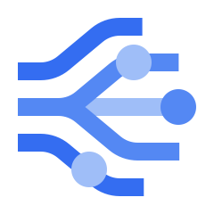
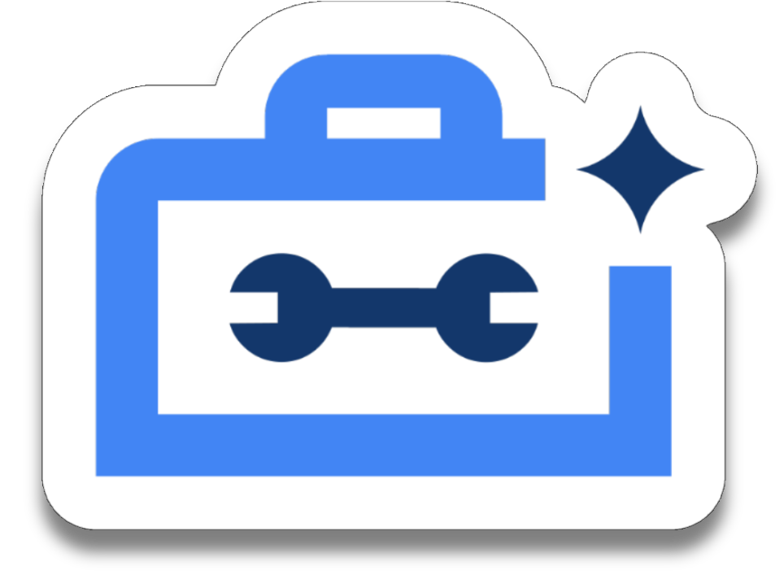

---
hide:
  - toc
---

# Tools for Agents

Check out the following pre-built tools that you can use with ADK agents:

### Gemini tools

  <a href="/adk-docs/tools/built-in-tools/#google-search" class="tool-card">
    

      
    

    

      <h3>Google Search</h3>
      
Perform web searches using Google Search with Gemini

    

  </a>

  <a href="/adk-docs/tools/built-in-tools/#code-execution" class="tool-card">
    

      
    

    

      <h3>Code Execution</h3>
      
Execute code using Gemini models

    

  </a>

### Google Cloud tools

  <a href="/adk-docs/tools/google-cloud-tools/#apigee-api-hub-tools" class="tool-card">
    

      
    

    

      <h3>Apigee API Hub</h3>
      
Turn any documented API from Apigee API hub into a tool

    

  </a>

  <a href="/adk-docs/tools/google-cloud-tools/#application-integration-tools" class="tool-card">
    

      
    

    

      <h3>Application Integration</h3>
      
Link your agents to enterprise applications using Integration Connectors

    

  </a>

  <a href="/adk-docs/tools/built-in-tools/#bigquery" class="tool-card">
    

      
    

    

      <h3>BigQuery Tools</h3>
      
Connect with BigQuery to retrieve data and perform analysis

    

  </a>

  <a href="/adk-docs/tools/built-in-tools/#bigtable" class="tool-card">
    

      
    

    

      <h3>Bigtable Tools</h3>
      
Interact with Bigtable to retrieve data and and execute SQL

    

  </a>

  <a href="/adk-docs/tools/built-in-tools/#gke-code-executor" class="tool-card">
    

      
    

    

      <h3>GKE Code Executor</h3>
      
Run AI-generated code in a secure and scalable GKE Sandbox environment

    

  </a>

  <a href="/adk-docs/tools/built-in-tools/#spanner" class="tool-card">
    

      
    

    

      <h3>Spanner Tools</h3>
      
Interact with Spanner to retrieve data, search, and execute SQL

    

  </a>

  <a href="/adk-docs/tools/google-cloud/mcp-toolbox-for-databases/" class="tool-card">
    

      
    

    

      <h3>MCP Toolbox for Databases</h3>
      
Connect over 30 different data sources to your agents

    

  </a>

  <a href="/adk-docs/tools/built-in-tools/#vertex-ai-rag-engine" class="tool-card">
    

      
    

    

      <h3>Vertex AI RAG Engine</h3>
      
Perform private data retrieval using Vertex AI RAG Engine

    

  </a>

  <a href="/adk-docs/tools/built-in-tools/#vertex-ai-search" class="tool-card">
    

      
    

    

      <h3>Vertex AI Search</h3>
      
Search across your private, configured data stores in Vertex AI Search

    

  </a>

### Third-party tools

  <a href="/adk-docs/tools/third-party/github/" class="tool-card">
    

      
    

    

      <h3>GitHub</h3>
      
Analyze code, manage issues and PRs, and automate workflows

    

  </a>

  <a href="/adk-docs/tools/third-party/hugging-face/" class="tool-card">
    

      
    

    

      <h3>Hugging Face</h3>
      
Access models, datasets, research papers, and AI tools

    

  </a>

## Build your tools

If the above tools don't meet your needs, you can build tools for your ADK
workflows using the following guides:

*   **[Function Tools](/adk-docs/tools/function-tools/)**: Build custom tools for
    your specific ADK agent needs.
*   **[MCP Tools](/adk-docs/tools/function-tools/)**: Connect MCP servers as tools
    for your ADK agents.
*   **[OpenAPI Integration](/adk-docs/tools-custom/openapi-tools/)**:
    Generate callable tools directly from an OpenAPI Specification.
